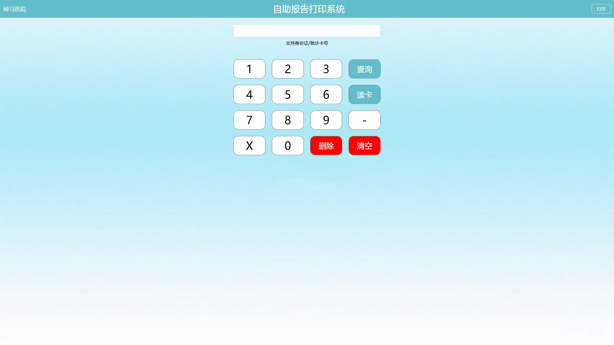

# 自助报表打印机 (SelfServiceReportPrinter)

这是一个用于演示不同实现方式的自助报表打印机项目，主要使用 WPF 技术开发，支持通过多种 MVVM 框架或模式实现功能，包括但不限于 CommunityToolkit 和 Prism。

## 项目结构

- **Models**: 包含数据模型（如 `User` 类）。
- **ViewModels**: 包含视图模型，提供 UI 数据绑定和逻辑处理。有多个实现版本：
  - `KeyPressViewModel`: 基于 `INotifyPropertyChanged` 的基础实现。
  - `KeyPressViewModelCommunityToolkit`: 使用 [CommunityToolkit.Mvvm](https://learn.microsoft.com/zh-cn/dotnet/communitytoolkit/mvvm/)（MVVM Toolkit）实现。
  - `KeyPressViewModelPrism`: 使用 [Prism](https://prismlibrary.com/) 框架实现。
- **Commands**: 包含自定义命令类（如 `RelayCommand` 和泛型 `RelayCommand<T>`）。
- **Services**: 包含服务类，如 `MessageBoxService`。
- **Helper**: 包含辅助类，如 `TextBoxSelectionHelper`。
- **Views**: 包含主窗口 UI 定义和代码后台。
- **Resources**: 包含通用资源文件。
- **Images**: 包含图片资源。

## 功能特性

- 提供一个交互式界面用于输入卡号。
- 支持数字输入、删除和清除操作。
- 通过不同的 MVVM 模式展示了实现方式的多样性。

## 使用说明

1. 克隆仓库到本地：
   ```
   git clone https://gitee.com/cplmlm/SelfServiceReportPrinter
   ```

2. 打开项目：
   使用 Visual Studio 打开 `SelfServiceReportPrinter.sln`。

3. 编译并运行：
   构建并运行项目，查看主窗口的功能。

4. 交互：
   - 使用界面上的按钮输入卡号。
   - 使用“Delete”删除最后一位数字。
   - 使用“Clear”清除输入框内容。

## 系统界面



## 贡献指南

欢迎提交代码改进、修复或新增功能。请遵循以下步骤：
1. Fork 项目。
2. 创建新的分支 (`git checkout -b feature/new-feature`)。
3. 提交更改 (`git commit -m 'Add some feature'`).
4. 推送分支 (`git push origin feature/new-feature`).
5. 提交 Pull Request。

## 许可证

本项目遵循 MIT 许可证。详细信息请参阅 [LICENSE](LICENSE) 文件。